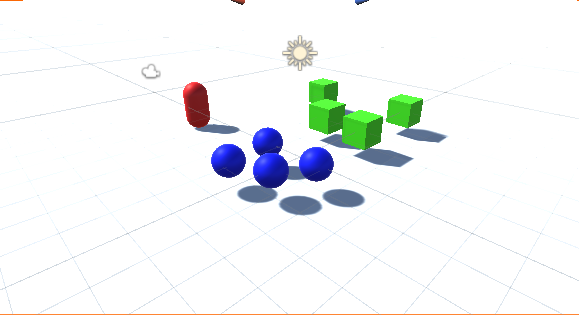

# Evaluación individual

## Objetivos

- [x] Debe incluir varias instancias de 2 tipos de objetos A, B  (pueden ser primitivas 3d). Los objetos de tipo B son físicos. Los objetos de tipo A son estáticos.
- [x] Debe incluir una UI que permita comprar energía que supondrá la intensidad con la que se realizarán los disparos. Se deben gestionar dos teclas de disparo
  *  [x] Disparo A: Se disminuye el poder y tamaño de los objetos de tipo A con lo que se esté en colisión, proporcionalmente a la energía.
  *  [x] Disparo B: Se cambia el color de los objetos con lo que se esá en colisión y aumenta el dinero disponible para la compra de energía .
- [] Cuando el jugador colisiona con objetos de tipo B se deben mover los objetos de tipo C de forma proporcional a su poder.
- [x] Subir un enlace a github con los scripts implementados y un gif de la ejecución. Subir también un zip que incluya estos mismos ficheros.

### Instancias de 2 tipos de objetos

[TypeA.cs](script/typeA.cs)
[TypeB.cs](script/typeB.cs)

### UI

##### Disparos:
[Shooting.cs](script/Shooting.cs)

##### Disparo tipo A:

##### Disparo tipo B:

##### Scripts del Jugador

### Proyecto 
[Unity Proyect](scene.zip)